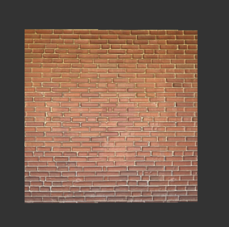
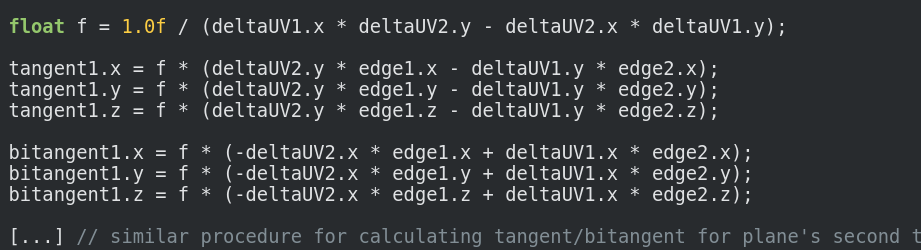
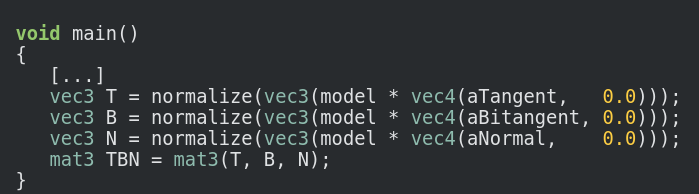

# Rendering Normal Maps




## Implementation Logistics

- You may use whatever operating system, IDE, or tools for completing this lab/assignment.
	- However, my instructions will usually be using the command-line, and that is what I will most easily be able to assist you with.
- In the future there may be restrictions, so please review the logistics each time.

**For this Lab/Assignment**: You will be working on your own laptop/desktop machine. Historically, the setup is the most difficult part of the assignment, because supporting multiple architectures and operating systems can be tricky. Nevertheless, we will get through it!

# Resources to help

Some additional resources to help you through this lab assignment

| SDL related links                                    | Description                       |
| --------------------------------------------------    | --------------------------------- |
| [SDL API Wiki](https://wiki.libsdl.org/APIByCategory) | Useful guide to all things SDL2   |
| [My SDL Youtube Playlist](https://www.youtube.com/playlist?list=PLvv0ScY6vfd-p1gSnbQhY7vMe2rng0IL0) | My Guide for using SDL in video form.   |
| [Lazy Foo](http://lazyfoo.net/tutorials/SDL/)         | Great page with written tutorials for learning SDL2. Helpful setup tutorials for each platform. |
| [Lazy Foo - Handling Key Presses](https://lazyfoo.net/tutorials/SDL/04_key_presses/index.php) | Useful tutorial for learning how to handle key presses | 

| OpenGL related links                                | Description                       |
| --------------------------------------------------  | --------------------------------- |
| [My OpenGL Youtube Series](https://www.youtube.com/playlist?list=PLvv0ScY6vfd9zlZkIIqGDeG5TUWswkMox) | My video series for learning OpenGL |
| [docs.gl](http://docs.gl)                           | Excellent documentation to search for OpenGL commands with examples and description of function parameters   |
| [learnopengl.com](https://learnopengl.com)          | OpenGL 3.3+ related tutorial and main free written resource for the course   |


(For this assignment)

* https://learnopengl.com/Advanced-Lighting/Normal-Mapping
* https://www.opengl-tutorial.org/intermediate-tutorials/tutorial-13-normal-mapping/
* Tutorial on normal mapping and how to make them
	* https://docs.unity3d.com/Manual/StandardShaderMaterialParameterNormalMap.html
* [Paul Bourkes page on textured obj files](http://paulbourke.net/dataformats/obj/minobj.html) (I recommend reading this one first for a minimal texture example)

# Description

The grand finale! err, at least for now :). The final step we will take in our progression of geometry, lighting, and texturing is to complete normal mapping. Normal maps allow us to lighten and darken pixels at a per-pixel granularity by sampling from a special normal map texture -- thus increasing the realism of our scene! For this PSET you will be normal mapping a 'brick wall'. You may otherwise decide to update your .obj loader to support this as well. By the end of this PSET you will have a good understanding of one of the best tricks in graphics that most games/movies use!

Ideally, you are working from your previous PSET but you are welcome to use the provider graphics framework to implement a 'normal mapped' brick wall. When you launch this assignment, you will otherwise see a texture with two textures (the normal map, and the albedo map (i.e. colors)). This is purely for you to see that two textures have been loaded.

## Task 1 - Rendering a Normal mapped Object


For this PSET  you are going to render a single textured **and normal mapped** piece geometry. If you'd like to use other .obj files and apply normal maps, you are welcome to do so, but I recommend you get the brick wall working first (that way you'll know the shader is working). If you do use .obj models with their own normal maps, please make sure to add them into the repo (Please keep the size small of any added assets < 20 MB).

### Light

For this PSET, you'll need some 'light' source to otherwise shine on the geometry so we can see the normals. It's fine to use a 'fixed' light source at the camera position, or otherwise use your previous spinning light from the prior PSET.

The light position in particular is important to help you debug your normal mapping. The way I have setup my solution (See animated gif at top of assignment), is that my light is fixed at the camera position (0,0,1). Then as I rotate my object, I will know if my tangent space transformation is working, because the 'back side' of the geometry will be effectively black (i.e. for my plane, I just have surface normals facing one direction, and no normals pointing backwards -- if you have any non-planar shape (e.g. The bunny), this however will not be true, as you'll have normals facing many directions). 

### bitangent and binormals

For part of this PSET, one of the things you will have to do is compute the correct binormals and bitangents for the geometry. That means you'll be passing in '14' total floats for your vertex attributes. I have setup with the starter code for the shader the ability to handle the '14' floating point values. **You will** otherwise have to compute the binormals and bi-tangents (i.e. the last 6 '0' values in the code sample below). Learnopengl.com gives a good explanation under the [Manual calculation of tangents and bitangents](https://learnopengl.com/Advanced-Lighting/Normal-Mapping) otherwise to assist you in computing the values.

```d
/// Helper function to return a textured quad with normals, binormals, and bitangents
SurfaceNormalMappedTriangle MakeTexturedNormalMappedQuad(){
  //TODO: For students to compute binormal and bitangents (either here, or by writing a helper function -- your choice!)
	return new SurfaceNormalMappedTriangle([
			-1.0,1.0,0.0,  0.0,1.0,     0,0,-1.0, 0,0,0, 0,0,0,
			-1.0,-1.0,0.0, 0.0,0.0,     0,0,-1.0, 0,0,0, 0,0,0,
			1.0,-1.0,0.0,  1.0,0.0,     0,0,-1.0, 0,0,0, 0,0,0,
			1.0,1.0,0.0,   1.0,1.0,     0,0,-1.0, 0,0,0, 0,0,0,
			-1.0,1.0,0.0,  0.0,1.0,     0,0,-1.0, 0,0,0, 0,0,0,
			1.0,-1.0,0.0,  1.0,0.0,     0,0,-1.0, 0,0,0, 0,0,0
	 ]
	);
}
```




Note: One way I have also abstracted the computation of the calculation of the binormals and bitangents, is to further break my quad into individual 'triangles'. (i.e. You can make a 'CreateTriangle' function that you call twice to make the two faces of the quad, and otherwise compute the positions, texture coordinates, normals, binormals, and tangents in one simple function).

### Shading

In regards to figuring out the shaders, you will have to create a 'TBN' matrix. I suggest reading the [Tangent Space Normal Mapping](https://learnopengl.com/Advanced-Lighting/Normal-Mapping) section of learnopengl.com for hints on this. You'll observe that your computations for lighting will be in regards to 'TangentSpace' positions for fragments, to otherwise correctly sample from the normal map.




### Task 2 - Interactive Graphics

- Pressing the <kbd>tab</kbd> key draws your object in wireframe mode (By default when you start the application it will show the model in filled).
- Pressing the <kbd>esc</kbd> key exits the application.
- Pressing the arrowkeys keys should move your camera forward and backwards

## Assignment Suggestions and Strategies 

### Debugging

- If you don't see anything, try capturing a frame with renderdoc .
    - At the least, you should see '2' 
    - Try to inspect if any uniform values are '0' otherwise
 
## Assignment Strategy

* If you do not understand tangent space, go back and understand local, world  space first.
  * The idea again is that you can multiply through a 'tangent matrix' (TBN) to figure out how to properly light up fragments based on a normal map at any angle. 

* Read the slides and read the tutorial. Normal mapping is all about math. We are diving in a little deep, but I have done some of the setup in the code to assist you (if you start with the starter code to just get the sahders working).
  * [www.learnopengl.com](https://learnopengl.com/Advanced-Lighting/Normal-Mapping) also provides some good notes on normal mapping.
  * [opengl-tutorial](http://www.opengl-tutorial.org/intermediate-tutorials/tutorial-13-normal-mapping/) also is a good resource
  * You can have a moving light or a fixed light if you like -- or alternatively a rotating object.
    * Rotating your model (or light) will show if things are working because the lighting will change based on the normals.
* Explore other sources, but cite them! If you find other tutorials please cite them--this is always required.
* You should scratch your head a few times when you look at the code. When you do this, you should dive into the support code and figure out what things are doing.
  * You are welcome to abandon the support code and write something from scratch (creativity is always encouraged in this class if you go above and beyond as well!), but I recommend using at least some parts of the support code or your previous assignments and the starter code provided!

### Loading your own models for this assignment

It is totally fine to provide your own school appropriate normal mapped 3D .obj files for this assignment. Some notes that may save you time debugging:

- Make sure you push the model, texture(s), and material file to the repository.
- If you use blender3D to export your own .obj model, make sure to scale it to about the size of a unit cube in Blender3D. This will save you time from moving the camera around a lot.
- Triangulate the faces within the blender3D (there is an option when you export)
- Check your material file to make sure it is loading .ppm images which we know how to handle. Use a program like [GIMP](https://www.gimp.org/) to convert them to ASCII format .ppm images otherwise.
- The .ppm image may be 'mirrored', meaning you have to flip it horizontally for the actual texture coordinates to line up with the appropriate vertices.

**You may assume one diffuse texture and one normal map per model for this assignment**

A few of the additional fields are specified in [Paul Burke's guide](http://paulbourke.net/dataformats/obj/minobj.html), which are primarily used for rendering a scene. For now, we are only interested in the color.

### How we will run your program

For this PSET we will run:

Either:
1. `dub`
2. `dub -- path_to_obj.obj path_to_mtl.mtl file` (If you choose to load a normal mapped model)

# Submission/Deliverables

### Submission

- Commit all of your files to github, including any additional files you create.
- Do not commit any binary files unless told to do so (i.e. the executable that you run does not need to be committed).
- Do not commit any 'data' files generated when executing a binary.

### Deliverables

- Commit your source code to this repository with your changes.
	- We should be able to execute your program by running by either:
	    - `dub` (Brick wall only)
	    - `dub -- path_to_obj.obj path_to_mtl.mtl file` or `dub --compiler=ldc2 -- path_to_obj.obj path_to_mtl.mtl file` or `dub --compiler=gdc-12 -- path_to_obj.obj path_to_mtl.mtl file`
  - (No need to ever commit binary/executable files to the repository)

# Going Further

What is that, you finished Early? Did you enjoy this lab/assignment? Here are some (optional) ways to further this assignment.

- You can build on top of this PSET such that you otherwise add as many functions as you like.

# F.A.Q. (Instructor Anticipated Questions)

- Q: My image shows up but is not the appropriate color (If you tried to load another PPM image (other than brick))
  - OpenGL likes square size textures (32x32, 64x64, etc)
    - Why is that? Even dimensions are easier to handle, and useful to create things like mipmaps
    - Also, my PPM parser is very simple! (I used GIMP to export an ASCII PPM and removed any comments in the file)
- Q: Why is the brick half blue and half brick
  - I am demonstrating how to load and display part of a texture. I had to start you with something :) Change this as you need! Observe in the fragment shader why this is.
* Q: Can I load my own models that I have made to show off?
  * A: Sure -- just make sure they are added to the repository (Including the diffuse and normal map texture) -- please keep these to < 20 MB!
* Q: How do I know it works?
  * A: There should always be some ambient component, so your object should not be totally dark.
  * A: For diffuse, the objects front should become darker as the light moves behind it -- that's how you'll know your normals are facing the right way.
  * A: For specular, you should see a 'bright spot' that somewhat lines up to where the light is shining. If this is too hard to see, try turning off temporarily the ambient and diffuse components.
* Q: I'm struggling in the shader?
  * A: Remember, to improve your iteration speed, you can
* Q: glsl says a variable does not exist, but I definitely have it in my code!
  * A: glsl tries to be efficient -- and that's probably a uniform variable you're referring too. If you don't use a variable (or if it's impossible to reach e.g. `if(false) { // uniform here }` ) then that variable will get optimized out.
  * Comment: That seems silly
  * Response: No. Consider that our vertex or fragment shaders may run 1000s or even millions of times per frame -- we need to be efficient.

# Found a bug?

If you found a mistake (big or small, including spelling mistakes) in this lab, kindly send me an e-mail. It is not seen as nitpicky, but appreciated! (Or rather, future generations of students will appreciate it!)

- Fun fact: The famous computer scientist Donald Knuth would pay folks one $2.56 for errors in his published works. [[source](https://en.wikipedia.org/wiki/Knuth_reward_check)]
- Unfortunately, there is no monetary reward in this course :)
